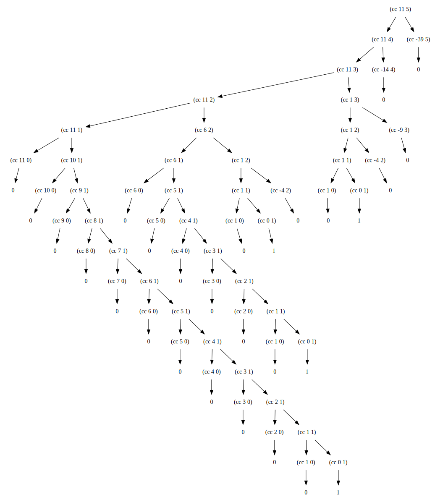

## P29 - [练习 1.14]

将 11 美分换成硬币，计算过程如下图所示。可以看到，这个树状展开很大，计算过程的所需空间和时间，都是指数增长。

------
上图并非手画的，而是使用 Lua 程序生成 Graphviz 绘图语言，再用 Graphviz 生成 svg 图片。见 [Lua 程序源码](exercise_1_14_dot.lua)。将 `count_change(11)` 一行修改其它值，可以生成其它值的计算过程。

Graphviz 在线工具[点这里](http://dreampuf.github.io/GraphvizOnline)。

