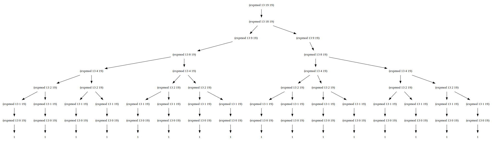
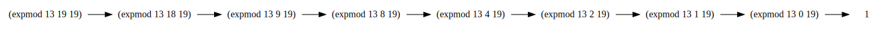

## P36 - [练习 1.26]

``` Scheme
(define (expmod base exp m)
  (cond ((= exp 0) 1)
        ((even? exp)
         (remainder 
          (* (expmod base (/ exp 2) m)
             (expmod base (/ exp 2) m))
          m))
        (else
         (remainder 
          (* base 
             (expmod base (- exp 1) m))
          m))))
```

如上 Louis 的实现中，`(expmod base (/ exp 2) m)` 出现两次，会在递归过程中计算了两次。于是每次递归，exp 数值减半，但却计算了两次。于是两者就抵消了，因此计算复杂度，就为 Θ(n)

而原来的实现中，使用了 `square`， `(expmod base (/ exp 2) m))` 只会计算一次。于是每次递归，exp 数值减半。因此计算复杂度为 Θ(logN)。

------

为了更直观地看到区别。稍微修改一下 [练习 1.14](./exercise_1_14.md) 的 `pretty_print_dot` 的代码，我们展开 `expmod(13, 19, 19)` 的计算图



可以看到，是个树状。越下层的节点，比如 `expmod(13, 1, 19)` 被重复计算越多次。

------

而原来的实现中，`expmod(13, 19, 19)` 的计算图很简单直接。



仅仅是上图最左边的路径。


