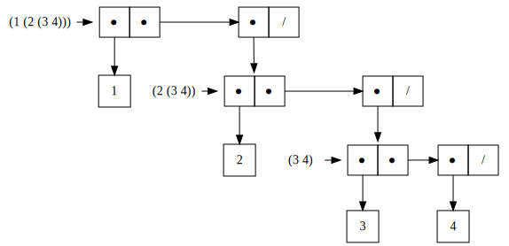
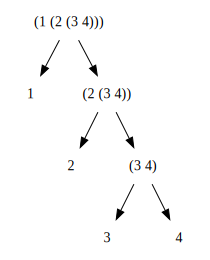

## P73 - [练习 2.24]

``` Scheme
(list 1 (list 2 (list 3 4)))
```

在 DrRacket 的打印结果为

``` Scheme
'(1 (2 (3 4)))
```

盒子指针结构如下



树形图如下



### 附

图是使用 Graphviz 绘画的。绘画盒子指针图的 Dot 代码如下

``` Dot
digraph G {
    plaintext_0 [label="(1 (2 (3 4)))", shape=plaintext]
    plaintext_1 [label="(2 (3 4))", shape=plaintext]
    plaintext_2 [label="(3 4)", shape=plaintext]

    node [shape=box width=0.5 height=0.5]
    label_1 [label="1"]
    label_2 [label="2"]
    label_3 [label="3"]
    label_4 [label="4"]

    node [label=< 
        <table border="0" cellborder="1" cellspacing="0"> <tr>
        <td width="34" height="34"  port="f0">●</td>
        <td width="34" height="34"  port="f1">●</td>
        </tr> </table>> shape=plaintext];
    cons_0
    cons_1
    cons_2
    
    node [label=< 
        <table border="0" cellborder="1" cellspacing="0"> <tr>
        <td width="34" height="34"  port="f0">●</td>
        <td width="34" height="34" port="f1">/</td>
        </tr> </table>> shape=plaintext];
    last_cons_0
    last_cons_1
    last_cons_2

    {rank = same; plaintext_0; cons_0; last_cons_0 }
    {rank = same; plaintext_1; cons_1; last_cons_1 }
    {rank = same; plaintext_2; cons_2; last_cons_2 }
    
    plaintext_0 -> cons_0 
    cons_0:f0 -> label_1
    cons_0:f1 -> last_cons_0:f0 [minlen = 4]
    last_cons_0:f0 -> cons_1
    plaintext_1 -> cons_1
    cons_1:f0 -> label_2
    cons_1:f1 -> last_cons_1:f0 [minlen = 4]
    last_cons_1:f0 -> cons_2
    plaintext_2 -> cons_2
    cons_2:f0 -> label_3
    cons_2:f1 -> last_cons_2:f0
    last_cons_2:f0 -> label_4 
}
```

树状图的 Dot 代码如下

``` Dot
digraph G {
    node [shape=plaintext]

    label_1 [label="1"]
    label_2 [label="2"]
    label_3 [label="3"]
    label_4 [label="4"]
        
    plaintext_0 [label="(1 (2 (3 4)))"]
    plaintext_1 [label="(2 (3 4))"]
    plaintext_2 [label="(3 4)"]
    
    plaintext_0 -> label_1
    plaintext_0 -> plaintext_1
    
    plaintext_1 -> label_2
    plaintext_1 -> plaintext_2
    
    plaintext_2 -> label_3
    plaintext_2 -> label_4
}
```

