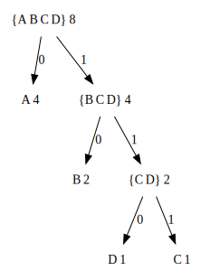

## P114 - [练习 2.67]

``` Scheme
(define sample-tree
  (make-code-tree (make-leaf 'A 4)
                  (make-code-tree (make-leaf 'B 2)
                                  (make-code-tree (make-leaf 'D 1)
                                                  (make-leaf 'C 1)))))
(define sample-message '(0 1 1 0 0 1 0 1 0 1 1 1 0))
```

Huffman 树的形状如图：



根据编码树，手工解码 `(0 1 1 0 0 1 0 1 0 1 1 1 0)`。

|剩余                       | 前缀      | 符号       | 
|--------------------------|-----------|-----------|
|0 1 1 0 0 1 0 1 0 1 1 1 0 | 0         |  A         |
|1 1 0 0 1 0 1 0 1 1 1 0   | 1 1 0     |  D         |
|0 1 0 1 0 1 1 1 0         | 0         |  A         |
|1 0 1 0 1 1 1 0           | 1 0       |  B         |
|1 0 1 1 1 0               | 1 0       |  B         |
|1 1 1 0                   | 1 1 1     |  C         |
| 0                        | 0         |  A         |

于是得到最终结果。

``` Scheme
'(A D A B B C A)
```

执行 [Huffman 编码树](huffman_tree.scm) 的程序，得到相同的结果。

