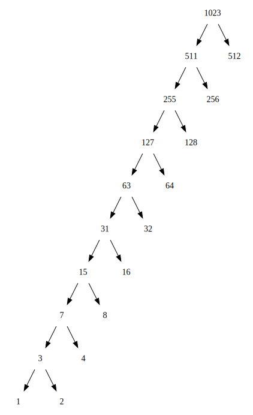

## P115 - [练习 2.71]

下面树形图只显示频率，不显示符号。

当 n = 5 时，图如下

当 n = 10 时，图如下

树的形状很有规律。对于这样的树，编码出现最频繁的符号使用 1 个二进制位。编码最不频繁的符号需要 n - 1 位。

------
树形图是使用 Graphviz 工具绘画的，使用 [这里的 Lua 代码](exercise_2_71_dot.lua)，修改 input_N 的数值，可以输出 Dot 代码。

