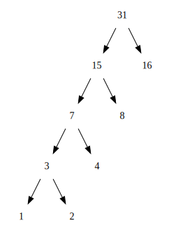

## P115 - [练习 2.72]

### 分析

[练习 2.68](./exercise_2_68.scm) 的 `encode-symbol` 函数如下:

``` Scheme
(define (encode-symbol symbol tree)
  (if (leaf? tree)
      (if (eq? symbol (symbol-leaf tree))
          '()
          #f)
      (let ((left-result (encode-symbol symbol (left-branch tree))))
        (if left-result
            (cons 0 left-result)
            (let ((right-result (encode-symbol symbol (right-branch tree))))
              (if right-result
                  (cons 1 right-result)
                  #f))))))
```

[练习 2.71](./exercise_2_71.md) 中 n = 5 时的树如下：



注意我们 `encode-symbol` 的递归实现中，会先搜索左分支 `left-branch`，假如左分支可以找到符号，就可直接编码，不再搜索右分支 `right-branch`。

在 n = 5 的树中，频率最不频繁的符号处于左分支的末端，而左分支优先，只需要搜索 n = 5 次，就可编码符号。

频率最频繁的符号处于右分支，并且在顶端。而左分支优先，于是 `encode-symbol` 需要遍历树的所有节点，才能找到匹配的叶节点，编码这个符号。而 n = 1 时，树节点有 1 个；n = 2 时，节点有 3 个; n = 3 时，节点有 5 个。依此类推，当为 n 时，节点有 2 * n - 1 个。于是编码频率最频繁的符号，需要搜索 2 * n - 1 次。

总结，练习 2.71 的树，编码频率最频繁的符号，增长速度为 2 * n - 1。编码最不频繁的符号，增长速度为 n。

### 验证

为了验证结论，可以在 [练习 2.69](exercise_2_69.scm) 的基础上添加一些输出代码，如下

``` Scheme
(define (encode-symbol symbol tree)
  ;; 输出测试信息
  (newline)
  (display "encode-symbol " )
  (display (weight tree))
  (if (leaf? tree)
      (if (eq? symbol (symbol-leaf tree))
          '()
          #f)
      (let ((left-result (encode-symbol symbol (left-branch tree))))
        (if left-result
            (cons 0 left-result)
            (let ((right-result (encode-symbol symbol (right-branch tree))))
              (if right-result
                  (cons 1 right-result)
                  #f))))))

;;;;;;;;;;;;;;;;
(define huffman-tree (generate-huffman-tree '((A 1) 
                                              (B 2) 
                                              (C 4) 
                                              (D 8)
                                              (E 16))))
(newline)
(encode '(A) huffman-tree)
(newline)
(encode '(E) huffman-tree)
```
我们在 `encode-symbol` 添加一些输出，打印出 weight。另外创建出如上图的频率树，依次编码最不频繁的符号 'A'，再编码最频繁的符号 'E'。

编码 'A' 的输出如下：

```
encode-symbol 31
encode-symbol 15
encode-symbol 7
encode-symbol 3
encode-symbol 1
```
可见编码 'A' 时，在树的左分支递归调用 `encode-symbol`。共 n = 5 次。

编码 'E' 的输出如下：

```
encode-symbol 31
encode-symbol 15
encode-symbol 7
encode-symbol 3
encode-symbol 1
encode-symbol 2
encode-symbol 4
encode-symbol 8
encode-symbol 16
```

可见编码 'E' 时，先左分支，再右分支，递归遍历了所有的树节点。共 n = 5 * 2 - 1 = 9 次。

