## P170 - [练习 3.10]

### (define W1 (make-withdraw 100))

### (W1 50)

### (define W2 (make-withdraw 100))

### 备注

图片使用 [draw.io](https://www.draw.io) 绘画。drawio.xml 文件在这里。[a](./drawio/exercise_3_10_a.drawio.xml)、[b](./drawio/exercise_3_10_b.drawio.xml)、[c](./drawio/exercise_3_10_c.drawio.xml)。

