## P172 - [练习 3.11]

### (define acc (make-account 50))

### ((acc 'deposit) 40)

### ((acc 'withdraw) 60)

### (define acc2 (make-account 100))

### 备注

图片使用 [draw.io](https://www.draw.io) 绘画。drawio.xml 文件在这里。[a](./drawio/exercise_3_11_a.drawio.xml)、[b](./drawio/exercise_3_11_b.drawio.xml)、[c](./drawio/exercise_3_11_c.drawio.xml)、[d](./drawio/exercise_3_11_d.drawio.xml)。

