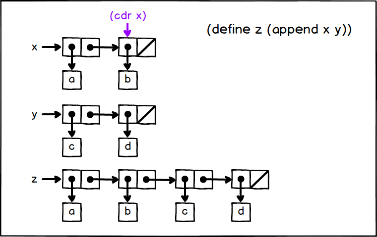
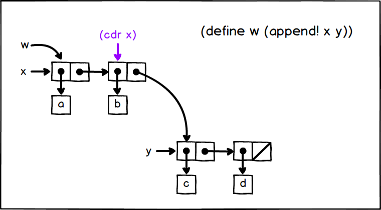

## P175 - [练习 3.12]

其中缺少的两个 <response> 分别返回

```
(b)
(b c d)
```

盒子指针图分别为：





## 代码

``` Scheme
#lang sicp

(define (append x y)
  (if (null? x)
      y 
      (cons (car x) (append (cdr x) y))))

(define (append! x y)
  (set-cdr! (last-pair x) y)
  x)

(define (last-pair x)
  (if (null? (cdr x))
      x 
      (last-pair (cdr x))))

;;;;;;;;;;;;;;;;
(define x (list 'a 'b))
(define y (list 'c 'd))
(define z (append x y))

z         ; (a b c d)
(cdr x)   ; (b)

(define w (append! x y))
w         ; (a b c d)
(cdr x)   ; (b c d)
```