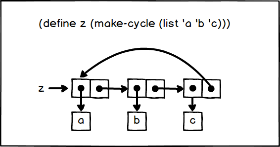

## P176 - [练习 3.13]

盒子指针图为：



当我们计算 `(last-pair z)` 时，程序会无限循环。

## 代码

``` Scheme
#lang sicp

(define (last-pair x)
  (if (null? (cdr x))
      x 
      (last-pair (cdr x))))

(define (make-cycle x)
  (set-cdr! (last-pair x) x)
  x)

;;;;;;;
(define z (make-cycle (list 'a 'b 'c)))
z               ; #0=(a b c . #0#)
; (last-pair z) ; 无限循环
```

注意到，DrRacket 可以检测到列表循环。z 显示为 `#0=(a b c . #0#)`。