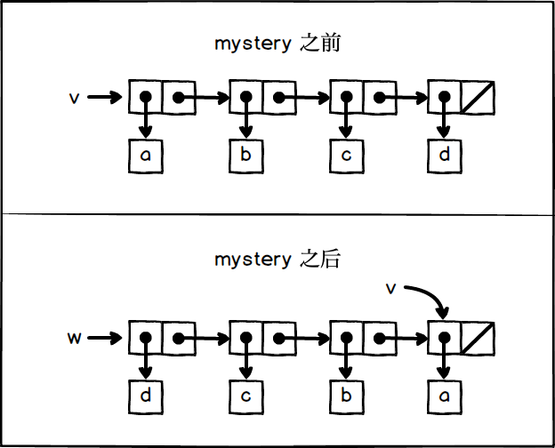

## P176 - [练习 3.14]
 
mystery 的作用是将列表翻转，相当于一个修改版的 reverse 函数，会修改传入的参数 x。

v 的最开始值为 `(a b c d)`。调用了 `(mystery v)`, 返回 v 的翻转，于是 w 为 `(d c b a)`。但修改了 v，调用后，v 为 `(a)`。

盒子指针图为:



### 代码

``` Scheme
#lang sicp

(define (mystery x)
  (define (loop x y)
    (if (null? x)
        y
        (let ((temp (cdr x)))
          (set-cdr! x y)
          (loop temp x))))
  (loop x '()))

;;;;;;;;;;;;;;;;;;;;;;
(define v (list 'a 'b 'c 'd))
v   ; (a b c d)

(define w (mystery v))
v   ; (a)
w   ; (d c b a)
```
