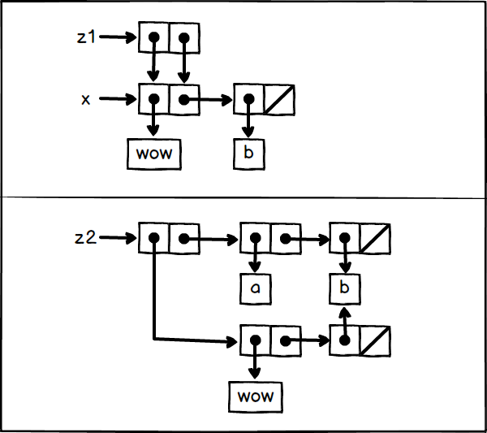

## P178 - [练习 3.15]
 
盒子指针图为:



`(car z1)` 和 `(cdr z1)` 都指向同一个对象 x。因此当使用 set-car! 修改 `car z1)`，也就同时改变了 `(cdr z1)`。

而 `(car z2)` 和 `(cdr z2)` 是分离的两个对象。因此就算修改了 `(car z2)`，`(cdr z2)` 也会保持不变。

### 代码

``` Scheme
#lang sicp

(define (set-to-wow! x)
  (set-car! (car x) 'wow)
  x)

(define x (list 'a 'b))
(define z1 (cons x x))
(define z2 (cons (list 'a 'b) (list 'a 'b)))

z1                ; ((a b) a b)
(set-to-wow! z1)  ; ((wow b) wow b)

z2                ; ((a b) a b)
(set-to-wow! z2)  ; ((wow b) a b)
```
