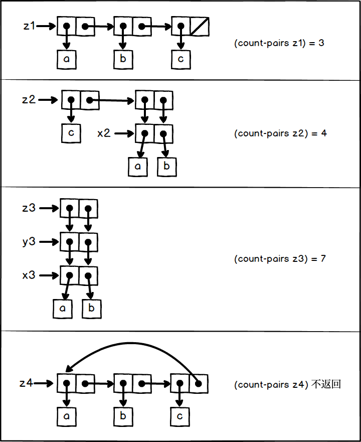

## P178 - [练习 3.16]
 
盒子指针图为:



### 代码

``` Scheme
#lang sicp

(define (count-pairs x)
  (if (not (pair? x))
      0
      (+ (count-pairs (car x))
         (count-pairs (cdr x))
         1)))

(define z1 (list 'a 'b 'c))
(count-pairs z1)    ; 3

(define x2 (cons 'a 'b))
(define z2 (cons 'c (cons x2 x2)))
(count-pairs z2)    ; 4

(define x3 (cons 'a 'b))
(define y3 (cons x3 x3))
(define z3 (cons y3 y3))
(count-pairs z3)    ; 7

(define z4 (list 'a 'b 'c))
(set-cdr! (cddr z4) z4)
; (count-pairs z4)  ; 无限循环
```
