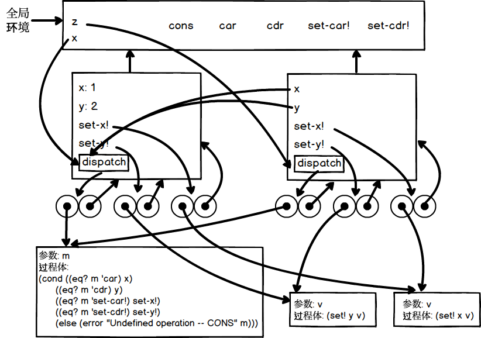
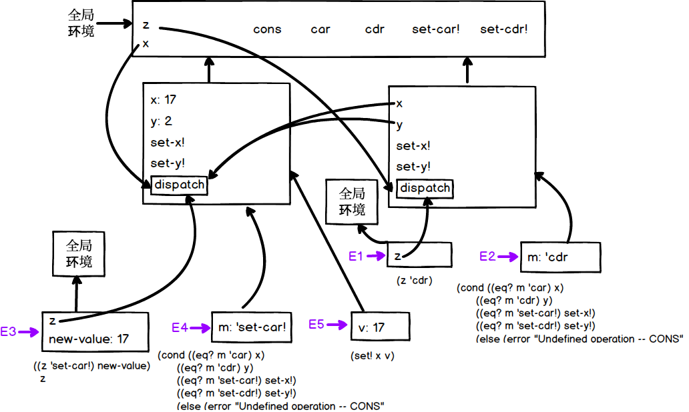
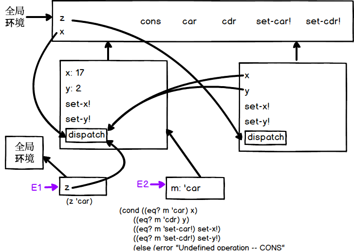

## P179 - [练习 3.20]
 
### x、z 环境

``` Scheme
(define x (cons 1 2))
(define z (cons x x))
```



---------

### (set-car! (cdr z) 17)



-------

### (car x)
 



### 代码

``` Scheme
#lang sicp

(define (cons x y)
  (define (set-x! v) (set! x v))
  (define (set-y! v) (set! y v))
  (define (dispatch m)
    (cond ((eq? m 'car) x)
          ((eq? m 'cdr) y)
          ((eq? m 'set-car!) set-x!)
          ((eq? m 'set-cdr!) set-y!)
          (else (error "Undefined operation -- CONS" m))))
  dispatch)

(define (car z) (z 'car))
(define (cdr z) (z 'cdr))
(define (set-car! z new-value)
  ((z 'set-car!) new-value)
  z)
(define (set-cdr! z new-value)
  ((z 'set-cdr!) new-value)
  z)

;;;;;;;;;;;;;;;;;;;;;;;;;;;;
(define x (cons 1 2))
(define z (cons x x))
(set-car! (cdr z) 17)
(car x)
```

