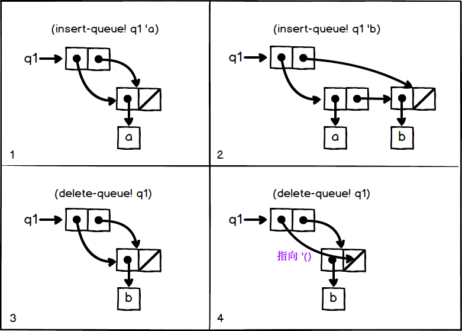

## P183 - [练习 3.21]

队列内部结构中，第 1 个 pair，(car q) 是前端指针，(cdr q) 是后端指针。标准的输出函数，不理解队列的结构，将 car 和 cdr 部分都打印出来了。而 (cdr q) 指向最后一个 pair，于是最后的元素在打印中，出现两次。

盒子指针图如下：



以图 2(右上方格)为例，打印 q1。q1 是个 pair，就会先打印 (car q1) 为 (a b), 再打印 (cdr q2) 为 (b)。于是图 2 的结构就会输出

```
((a b) b)
```

要正确输出列表的元素，print-queue 只需要输出 car 部分，可以实现为

``` Scheme
(define (print-queue queue)
  (display (car queue))
  (newline))
```
 
完整的代码[见这里](./queue.scm)。


