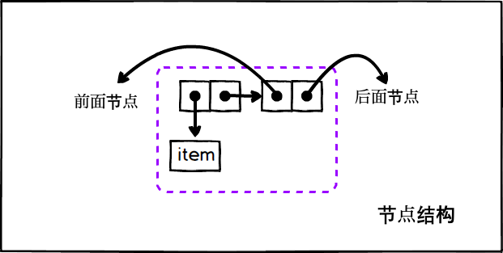
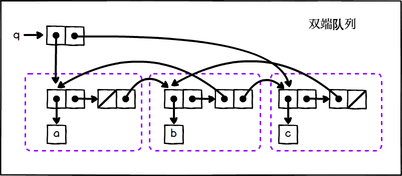

## P183 - [练习 3.23]

[完整的代码在这里](./exercise_3_23.scm)，思路在此解释一下。

### 思路
 
双端队列，前后端都可插入删除数据，并且要让所有操作都在 O(1) 完成。

要达到这个需求，每个节点都需要有指向前后节点的指针。这样当在列表后面删除节点时，可以从 prev 指针找回前一个节点，重新设置尾部指针。这种结构，实际是双链表(double linked list)。

我们先定义出节点(node)的结构，再在节点的基础上实现双端队列。

### 节点

``` Scheme
(define (make-queue-node item prev next) (cons item (cons prev next)))
```

每个节点由两个 pair 构成，其盒子图如下：



### 队列

每个节点可看成是个整体，之后将节点链接起来。存储 (a b c) 三个数据的双端队列，盒子指针图如下：



