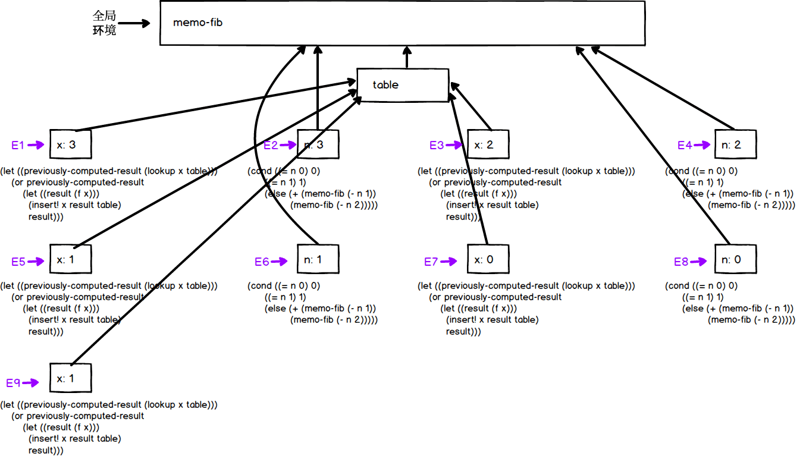

## P188 - [练习 3.27]

[完整的测试代码在这里](./exercise_3_27.scm)

### 计算图

`(memo-fib 3)` 的计算图为：



### 分析 mem-fib

对于每个 n, `(mem-fib n)` 只会计算一次，下次就可以从表格中返回计算结果。

比如 E5 中计算 `(mem-fib 1)` 的结果，并添加进表格。于是 E9 再次计算 `(mem-fib 1)` 时，表格中已经有了 key = 1 的计算结果，就可以直接返回计算结果，不用重复计算。

因此计算过程中 n 会线性下降，并不会像普通的递归 fib 那样分叉成树状。也就是说，mem-fib 计算步骤正比于 n。

为了看得更清楚，可以在 mem-fib 添加一些打印信息：

``` Scheme
(define memo-fib
  (memoize (lambda (n)
             (display "call memo-fib ")
             (display n)
             (newline)
             (cond ((= n 0) 0)
                   ((= n 1) 1)
                   (else (+ (memo-fib (- n 1))
                            (memo-fib (- n 2))))))))

(memo-fib 5)
```
输出

```
memo-fib 5
memo-fib 4
memo-fib 3
memo-fib 2
memo-fib 1
memo-fib 0
5
```

看到 n 确实会线性下降。

### 分析 (memoize fib)

假如将 memo-fib 定义成 `(memoize fib)`，并不能达到预期效果。memo-fib 会调用 fib, 但 fib 还是会递归调用原来的 fib, fib 并没有表格记录之前的计算结果。

在 fib 添加一些打印信息，可以看得更清楚。

``` Scheme
(define (fib n)
  (display "call fib ")
  (display n)
  (newline)
  (cond ((= n 0) 0)
        ((= n 1) 1)
        (else (+ (fib (- n 1))
                 (fib (- n 2))))))

(define memo-fib-2 (memoize fib))
(memo-fib-2 5)
```

输出

```
call fib 5
call fib 4
call fib 3
call fib 2
call fib 1
call fib 0
call fib 1
call fib 2
call fib 1
call fib 0
call fib 3
call fib 2
call fib 1
call fib 0
call fib 1
5
```

可见，`(fib 3)`、`(fib 2)`、`(fib 1)` 等都被重复调用了。

假如非要写成 `(memoize fib)`，可以使用 set! 修改全局环境中的 fib, 将其修改为记忆版本，如:

``` Scheme
(define memo-fib-2 (memoize fib))
(set! fib memo-fib-2)
(memo-fib-2 5)
```

这样可以避免重复计算，但也改变了 fib 原本的含义，恐怕会有隐患。输出为：

```
call fib 5
call fib 4
call fib 3
call fib 2
call fib 1
call fib 0
5
```
