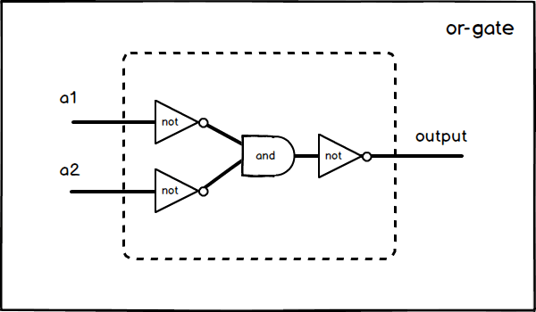

## P192 - [练习 3.29]

[完整代码](./exercise_3_29.scm)

### 公式

根据 [De Morgan 定律](https://zh.wikipedia.org/wiki/德摩根定律)。

``` C
~(a || b) = (~a) && (~b)
```

于是

``` C
a || b = ~~(a || b) = ~((~a) && (~b))
```

上述是 C 语言的记法。

* ~ 表示取反(not)
* && 是逻辑与(and)
* || 是逻辑或(or)

### 图形

根据上面公式，或门可以表示为



### 延迟

从上图可以清楚看出，a1 信号到达 output, 依此经过 inverter、and-gate、inverter，因此信号 a1 到 output 的延迟为 

```
2 * inverter-delay + and-gate-delay
```

同理，a2 信号到 output 的延迟跟 a1 相同。因此整个 or-gate 延迟为

```
2 * inverter-delay + and-gate-delay
```

### 代码

``` Scheme
(define (or-gate a1 a2 output)
  (let ((b (make-wire)) 
        (c (make-wire))
        (d (make-wire))
        )
    (inverter a1 b)
    (inverter a2 c)
    (and-gate b c d)
    (inverter d output)
    'ok))
```

[完整代码](./exercise_3_29.scm)


