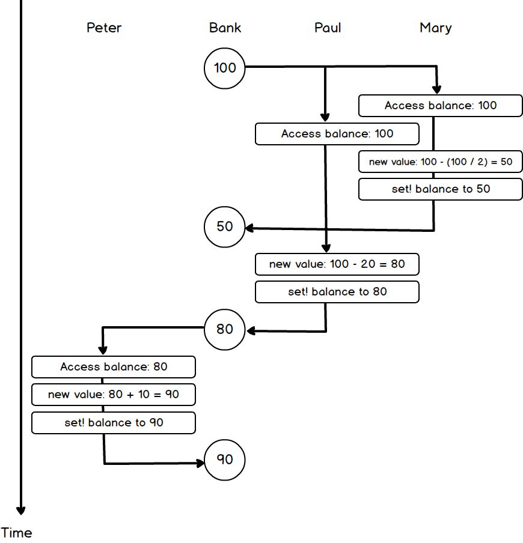

## P210 - [练习 3.38]

* [问题 a 完整程序](./exercise_3_38_a.scm)
* [问题 b 完整程序](./exercise_3_38_b.scm)

### a)

Peter、Paul、Mary 三个进程按某种顺序运行，其排列有 6 种。比如顺序 `(Peter Paul Mary)`，相当于执行下面代码：

``` Scheme
#lang racket

(define balance 100)

(set! balance (+ balance 10))             ; 'Peter
(set! balance (- balance 20))             ; 'Paul
(set! balance (- balance (/ balance 2)))  ; 'Mary

(display balance)
```

balance 的最后结果为 45。

但为避免手动调整代码顺序，可生成 `(list 'Peter 'Paul 'Mary)` 每个排列，遍历每种顺序。

[完整程序在这里](./exercise_3_38_a.scm)。

输出为:

```
(Peter Paul Mary): 45
(Peter Mary Paul): 35
(Paul Peter Mary): 45
(Paul Mary Peter): 50
(Mary Peter Paul): 40
(Mary Paul Peter): 40
```

根据时序不同，balance 的可能值为 45、35、50、40。

### b)

假如允许每个进程交错进行。每个进程都可分为 3 步：

1. 获取 balance。
2. 计算新值。
3. 设置 balance。

3 步随时可被其它进程打断。为得到全部结果，我们需要遍历每种可能的顺序。

观察到第 2 步（计算新值）是每个进程独立的，其顺序并不会影响最终结果。因此为了简化计算，可以简化成 2 步。

1. 获取 balance。
2. 计算新值，设置 balance。

注意有个细节，Mary 的进程为

``` Scheme
(set! balance (- balance (/ balance 2))
```

Mary 需要获取 balance 两次，每次都可能被打断。

于是我们生成 

`(list 'Peter-Get 'Peter-Set 'Paul-Get 'Paul-Set 'Mary-Get-1 'Mary-Get-2 'Mary-Set)`

的全部排列，7 项排列共 5040 种情况。Mary 需要获取 balance 两次，就拆分成 Mary-Get-1、Mary-Get-2。

每个进程中，必须先执行 get, 再执行 set。于是有下面的强制顺序

* Peter-Get、Peter-Set
* Paul-Get、Paul-Set
* Mary-Get-1、Mary-Get-2、Mary-Set

拿 Mary 进程来说，3 项的排列为 3!。但在强制顺序下，只剩下一种排列。于是过滤掉强制顺序，可能情况为 `5040 / (2! * 2! * 3!) = 210` 种。

生成所有可能的排列顺序，逐一运行，得到每种可能的结果。

[完整程序在这里](./exercise_3_38_b.scm)。

输出如下（输出太长，没有全部列出):

```
(Peter-Get Peter-Set Paul-Get Paul-Set Mary-Get-1 Mary-Get-2 Mary-Set): 45
(Peter-Get Peter-Set Paul-Get Mary-Get-1 Paul-Set Mary-Get-2 Mary-Set): 35
(Peter-Get Peter-Set Paul-Get Mary-Get-1 Mary-Get-2 Paul-Set Mary-Set): 55
(Peter-Get Peter-Set Paul-Get Mary-Get-1 Mary-Get-2 Mary-Set Paul-Set): 90
(Peter-Get Peter-Set Mary-Get-1 Paul-Get Paul-Set Mary-Get-2 Mary-Set): 35
(Peter-Get Peter-Set Mary-Get-1 Paul-Get Mary-Get-2 Paul-Set Mary-Set): 55
(Peter-Get Peter-Set Mary-Get-1 Paul-Get Mary-Get-2 Mary-Set Paul-Set): 90
....
(Mary-Get-1 Mary-Get-2 Mary-Set Peter-Get Peter-Set Paul-Get Paul-Set): 40
(Mary-Get-1 Mary-Get-2 Mary-Set Peter-Get Paul-Get Peter-Set Paul-Set): 30
(Mary-Get-1 Mary-Get-2 Mary-Set Peter-Get Paul-Get Paul-Set Peter-Set): 60
(Mary-Get-1 Mary-Get-2 Mary-Set Paul-Get Peter-Get Peter-Set Paul-Set): 30
(Mary-Get-1 Mary-Get-2 Mary-Set Paul-Get Peter-Get Paul-Set Peter-Set): 60
(Mary-Get-1 Mary-Get-2 Mary-Set Paul-Get Paul-Set Peter-Get Peter-Set): 40
'(50 60 30 110 70 80 25 40 90 55 35 45)
```

根据顺序不同，最终 balance 的可能值为 `(50 60 30 110 70 80 25 40 90 55 35 45)`。

### 画图

不可能每种情况都画出来，只画

```
(Peter-Get Paul-Get Paul-Set Mary-Get-1 Peter-Set Mary-Get-2 Mary-Set): 70
```

这种情况的时序图。



