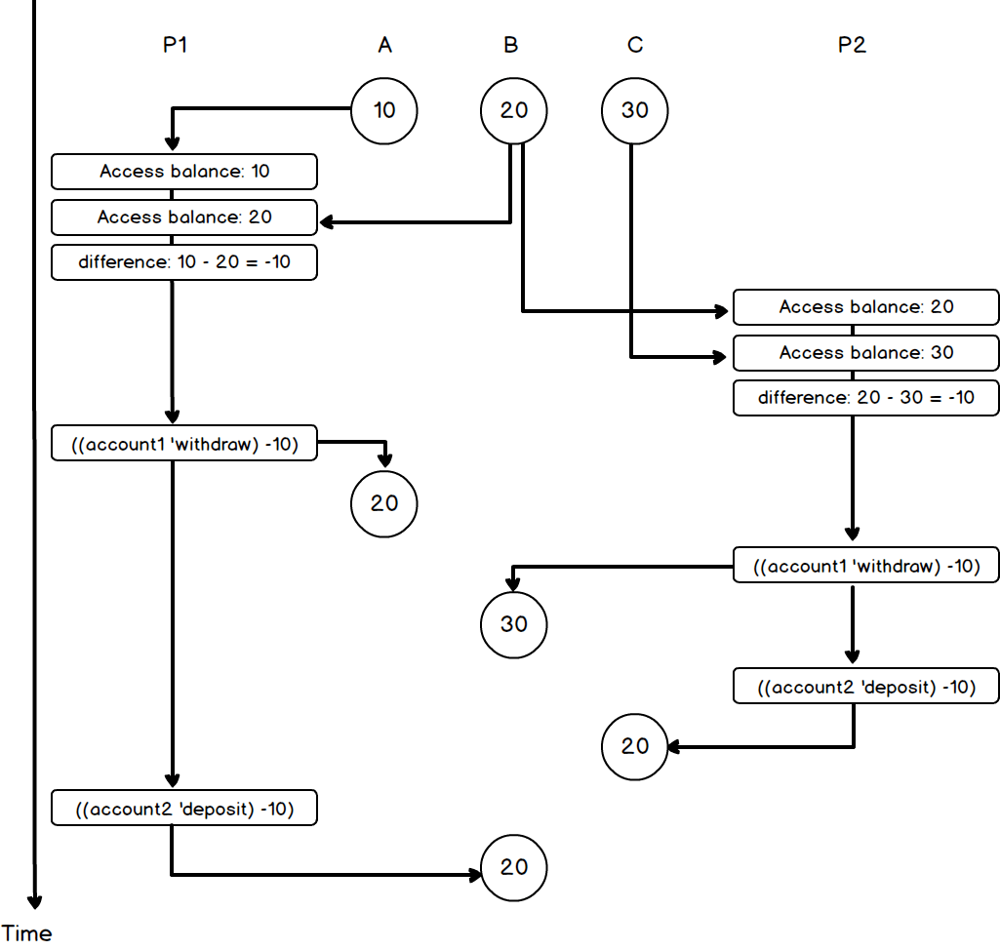
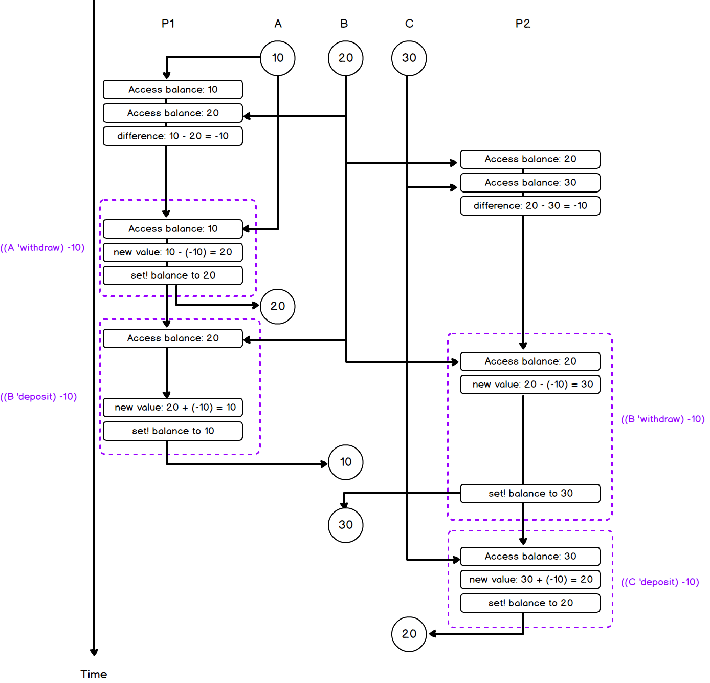

## P215 - [练习 3.43]

### a)

三个账号的初始余额是 (10、20、30) 的一个排列。考虑任意一个交换操作，假如进程顺序执行，交换只是改变两个余额的顺序，并不产生新的余额值。于是交换前余额是 (10、20、30) 的一个排列，交换后余额也必然是 (10、20、30) 的一个排列。

余额是 (10、20、30) 的一个排列，这个性质，在交换操作下是不变的。于是初始余额是 (10、20、30) 的一个排列，经历任意次交换也不改变这种特性，最终状态下，余额也必然是 (10、20、30) 的一个排列。

### b)

本节开始的 exchange 版本，其实现可以分为几个独立部分

```
1. (account1 'balance)
2. (account2 'balance)
3. 计算 difference
4. ((account1 'withdraw) difference)
5. ((account2 'deposit) difference)
```

每部分自身不可分割，但之间都可被其它进程打断。我们并行执行

```
P1: (exchange A B)
P2: (exchange B C)
```

有可能产生下面的时序

```
P1: (A 'balance) = 10
P1: (B 'balance) = 20
P1: 计算 difference = -10
P2: (B 'balance) = 20
P2: (C 'balance) = 30
P2: 计算 difference = -10
P1: ((A 'withdraw) -10) ; A 余额为 20
P2: ((B 'withdraw) -10) ; B 余额为 30
P2: ((C 'deposit) -10)  ; C 余额为 20
P1: ((B 'deposit) -10)  ; B 余额为 20
``` 

于是三个账号的最终余额都为 20。注意 P214 下面的注释，扩展了 withdraw 和 deposit，可以接受负数。时序图如下:



### c)

正如前面的分析，本节开始的 exchange，可分解为 5 步。

```
1. (account1 'balance)
2. (account2 'balance)
3. 计算 difference
4. ((account1 'withdraw) difference)
5. ((account2 'deposit) difference)
```

前 3 步并不影响总余额。而上述第 4、第 5 步 只操作单个账号，并且单个账号受到串行保护，第 4、第 5 步本身可以看作不可分割的整体。于是 4、5 步之间无论是否被打断，中间插入其它操作。只要 exchange 可以最终执行完，withdraw 和 deposit 相互抵消，可以保证账号总余额不变。

于是单个 exchange 可以保证总余额不变，任意个 exchange 也自然可以保证总余额不变。

### d)

本节开始的 exchange，可以使得总余额不变。是第 4、5 步受到串行保护，自身是不可打断的整体。假如账号不被串行化，第 4、5 步还可能被再次分解。exchange 这时就变为。

```
1. (account1 'balance)
2. (account2 'balance)
3. 计算 difference
4. account1: 获取 balance
5. account1: 计算 new-value (blance - amount)
6. account1: 设置 balance
7. account2: 获取 balance
8. account2: 计算 new-value (blance + amount)
9. account2: 设置 balance
```

其中第 4-7 是原来的 `((account1 'withdraw) difference)` 的分解, 7-9 是原来的 `((account2 'deposit) difference)` 的分解。

这时并行执行

```
P1: (exchange A B)
P2: (exchange B C)
```

考虑下面的时序

```
P1: (A 'balance) = 10
P1: (B 'balance) = 20
P1: 计算 difference = -10
P2: (B 'balance) = 20
P2: (C 'balance) = 30
P2: 计算 difference = -10
P1: A 账号 - 获取 balance = 10
P1: A 账号 - 计算 new-value (blance - amount) = 20
P1: A 账号 - 设置 balance = 20
P1: B 账号 - 获取 balance = 20
P2: B 账号 - 获取 balance = 20
P2: B 账号 - 计算 new-value (blance - amount) = 30
P1: B 账号 - 计算 new-value (blance + amount) = 10
P1: B 账号 - 设置 balance = 10
P2: B 账号 - 设置 balance = 30
P2: C 账号 - 获取 30
P2: C 账号 - 计算 new-value (blance + amount) = 20
P2: C 账号 - 设置 balance = 20
```

最终 A、B、C 账号的余额为 (20, 30, 20)。总余额也改变了。时序图如下:




