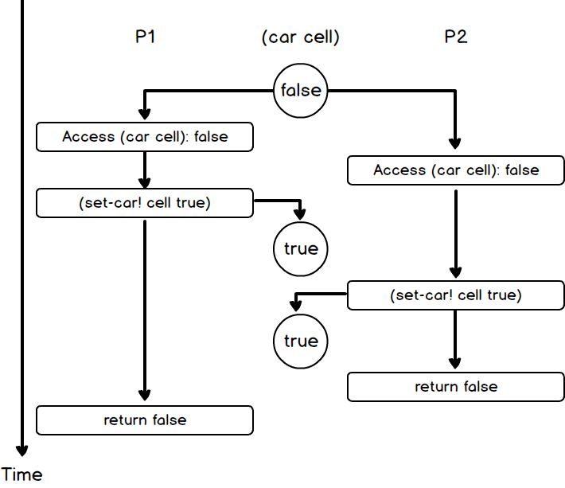

## P217 - [练习 3.46]

假如 `test-and-set!` 并非原子操作，P1、P2 并行执行 `(mutex 'acquire)`，触发 `test-and-set!` 函数。

可能出现下图的时序：

这时 P1、P2 都返回 false。于是 `(mutex 'acquire)` 就都会返回，P1、P2 同时获取到 mutex, 这明显是错的。

原子操作的 `test-and-set!`，不可能两个并行计算过程都返回 false。

