## P167 - [练习 3.9]

### 递归版本

过程对象

求值环境

### 迭代版本

过程对象

### 递归版本

求值环境

### 备注

图片使用 [draw.io](https://www.draw.io) 绘画。drawio.xml 文件在这里。[a](./drawio/exercise_3_9_a.drawio.xml)、[b](./drawio/exercise_3_9_b.drawio.xml)、[c](./drawio/exercise_3_9_c.drawio.xml)、[d](./drawio/exercise_3_9_d.drawio.xml)。

