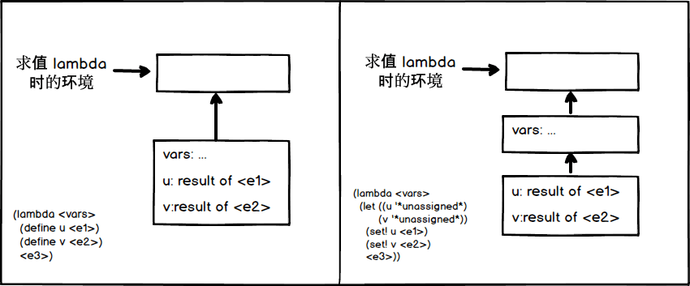

## P270 - [练习 4.17]

### a)

变换前和变换后的代码，执行 `<e3>` 的环境图如下：



转换后代码为

``` Scheme
(lambda <vars>
  (let ((u '*unassigned*)
        (v '*unassigned*))
    (set! u <e1>)
    (set! v <e2>)
    <e3>))
```

见 [练习 4.6](./exercise_4_6.md), let 语法只是 lambda 的派生表达式。每个 let 语句会对应一个 lambda。而执行 lambda 会产生多一个环境框架。因此变换后的代码，会比之前多一个框架。

### b)

见上图，变换后的代码，执行 `<e3>`，查找 vars 的值时。在最内层框架找不到 vars, 就会自动查找更外层的环境框架。这时就会找到了。并且 vars 值跟变换前的代码，执行时保持一致。

因而变换后的代码，就算多了一个框架，也不会影响程序的执行。

### c)

要不产生更多的框架，`scan-out-defines` 可以将所有的 define 语句放到最前面。比如

``` Scheme
(
 (define a 1)
 (+ a b)
 (define b 1)
)
```

就转换为

``` Scheme
(
 (define a 1)
 (define b 1)
 (+ a b)
)
```

其实现为

``` Scheme
(define (filter predicate sequence)
  (if (null? sequence)
      '()
      (if (predicate (car sequence))
          (cons (car sequence) (filter predicate (cdr sequence)))
          (filter predicate (cdr sequence)))))

(define (scan-out-defines body)
  (define (body-defines body)
    (filter definition? body))
  (define (body-not-defines body)
    (filter (lambda (exp) (not (definition? exp))) body))
  (let ((defines (body-defines body)))
    (if (null? defines)
        body
        (append (body-defines body) (body-not-defines body)))))
```

对比 [练习 4.16](./exercise_4_16.md) 中 `scan-out-defines` 的实现，两者行为是有不同的。练习 4.16 中的实现，会保留语句的顺序，假如执行

``` Scheme
(define (f)
  (define a 1)
  (+ a b)
  (define b 1))
(f)
```

因为 b 还没有赋值，会产生错误 `variable is unassigned b`。

而这里的实现，为了省略一个框架，将 `define` 语句都调整到前面。上面测试代码会执行成功，结果为 2。

我认为[练习 4.16](./exercise_4_16.md)中的实现，保留语句顺序会更加合理。调整语句顺序，会产生某些意外行为。