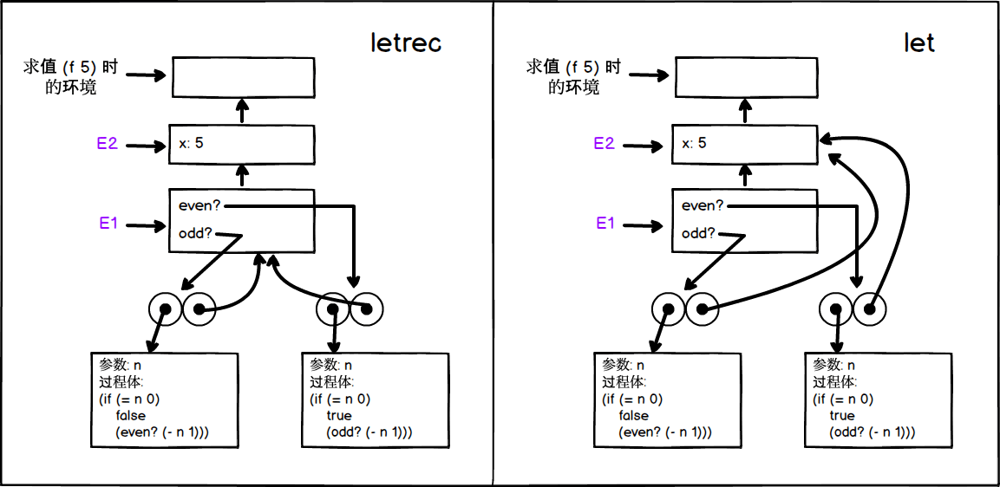

## P271 - [练习 4.20]

### a)

我们将 letrec 实现成 let 的派生表达式。下面代码

``` Scheme
(letrec ((even?
           (lambda (n)
             (if (= n 0)
                 true
                 (odd? (- n 1)))))
         (odd?
           (lambda (n)
             (if (= n 0)
                 false
                 (even? (- n 1))))))
  <rest of body of f>)
```

会转换为

``` Scheme
(let ((even? '*unassigned*) 
      (odd? '*unassigned*)) 
  (set! even? (lambda (n) 
                (if (= n 0) 
                    true 
                    (odd? (- n 1))))) 
  (set! odd? (lambda (n) 
               (if (= n 0) 
                   false 
                   (even? (- n 1))))) 
  <rest of body of f>)
```

在 [mceval.scm](./mceval.scm) 的基础上修改测试。`eval` 添加判断

``` Scheme
((letrec? exp) (eval (letrec->let exp) env))
```
 
`letrec` 语法实现为 

``` Scheme
(define (letrec? exp) (tagged-list? exp 'letrec))

(define (letrec->let exp)
  (define (letrec-body exp) (cddr exp))
  (define (name-unassigned exp) 
    (map (lambda (pair) (list (car pair) ''*unassigned*)) (cadr exp)))
  (define (name-sets exp)
    (map (lambda (pair) (list 'set! (car pair) (cadr pair))) (cadr exp)))
  (append (list 'let (name-unassigned exp))
          (append (name-sets exp) (letrec-body exp))))
```

### b)

执行 `(f 5)` 时，分别使用 letrec 和 let 的环境图如下。



区别在于 `even?` 和 `odd?` 关联的最内层环境。

使用 letrec，如左图所示，环境指向 E1，因而执行过程体中的语句，可以顺利找到 even? 和 odd? 的定义。

使用 let 时，如右图所示，环境指向 E2, 执行语句时，就找不到 even? 和 odd? 的定义，从而出错。

PS: 

在 DrRacket 中，使用 let 语句，程序也不会出错，原因在于 Scheme 系统在全局环境中也定义了 even?、odd?。假如名字加上 my_ 前缀，修改成下面样子

``` Scheme
(define (f x)
  (let ((my_even?
          (lambda (n)
            (if (= n 0)
                true
                (my_odd? (- n 1)))))
        (my_odd?
          (lambda (n)
            (if (= n 0)
                false
                (my_even? (- n 1))))))
    (my_even? x)))
(f 2)
```

程序就报错了。而将 `let` 换成 `letrec`, 从 E1 环境中可以顺序找到 `my_event?`、`my_odd?`, 就可正常执行。


