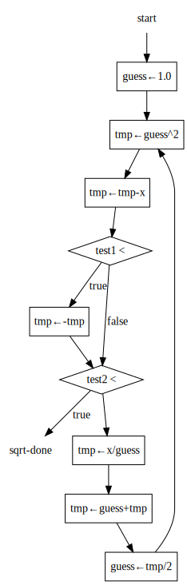

## P349 - [练习 5.3]

### 逐步展开

sqrt 机器，假设 `good-enough?` 和 `improve` 是基础操作。

``` Scheme
(controller
  (assign guess (const 1.0))
test-guess  
  (test (op good-enough?) (reg guess))
  (branch (label sqrt-done))
  (assign guess (op improve) (reg guess))
  (goto (label test-guess))
sqrt-done)
```

`good-enough?` 机器，假设 `square` 和 `abs` 是基础操作。

``` Scheme
(controller
  (assign tmp (op square) (reg guess))
  (assign tmp (op -) (reg tmp) (reg x))
  (assign tmp (op abs) (reg tmp))
  (test (op <) (reg tmp) (const 0.001)))
```

`good-enough?` 机器，展开 `square` 和 `abs` 为算术运算

``` Scheme
(controller
  (assign tmp (op *) (reg guess) (reg guess))
  (assign tmp (op -) (reg tmp) (reg x))
  (test (op <) (reg tmp) (const 0))
  (branch (label abs-neg))
  (goto (label abs-done))
abs-neg
  (assign tmp (op -) (reg tmp))
abs-done
  (test (op <) (reg tmp) (const 0.001)))
```

`improve` 机器，假设 `average` 是基础操作。

``` Scheme
(controller
  (assign tmp (op /) (reg x) (reg guess))
  (assign tmp (op average) (reg guess) (reg tmp)))
```

`improve` 机器，展开 `average` 为算术运算。

``` Scheme
(controller
  (assign tmp (op /) (reg x) (reg guess))
  (assign tmp (op +) (reg guess) (reg tmp))
  (assign tmp (op /) (reg tmp) (const 2)))
```

### 完整的 sqrt 机器

将 `good-enough?` 和 `improve` 机器，嵌入到 sqrt 机器中。得到最终的 sqrt 机器，只使用基本的算术运算实现。

``` Scheme
(controller
  (assign guess (const 1.0))
  
test-good-enough
  (assign tmp (op *) (reg guess) (reg guess))
  (assign tmp (op -) (reg tmp) (reg x))
  (test (op <) (reg tmp) (const 0))
  (branch (label abs-neg))
  (goto (label abs-done))
abs-neg
  (assign tmp (op -) (reg tmp))
abs-done
  (test (op <) (reg tmp) (const 0.001))

  (branch (label sqrt-done))
  
  (assign tmp (op /) (reg x) (reg guess))
  (assign tmp (op +) (reg guess) (reg tmp))
  (assign guess (op /) (reg tmp) (const 2))
  
  (goto (label test-good-enough))
sqrt-done)
```

上述的 sqrt 机器，使用 x、guess、tmp 三个寄存器。其中 x 为输入，guess 为最终输出。

### 数据通道图

这个图线太多，有点乱。使用 [Graphviz](http://dreampuf.github.io/GraphvizOnline) 绘画，[dot 源码在这里](./exercise_5_3_datapath.dot)。


### 控制器图

[dot 源码在这里](./exercise_5_3_ctrl.svg)。


