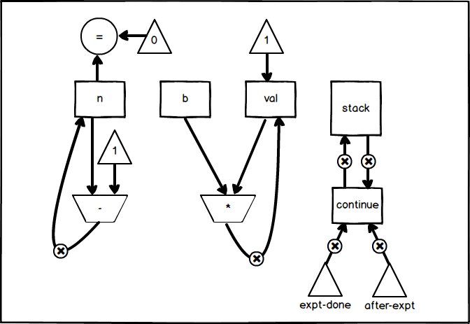
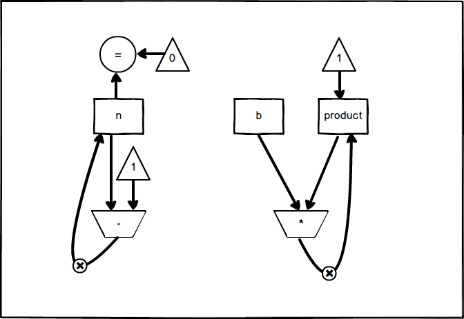

## P357 - [练习 5.4]

### a)

``` Scheme
(controller
  (assign continue (label expt-done))
expt-loop
  (test (op =) (reg n) (const 0))
  (branch (label base-case))
  
  (save continue)
  (assign n (op -) (reg n) (const 1))
  (assign continue (label after-expt))
  (goto (label expt-loop))
  
after-expt
  (restore continue)
  (assign val (op *) (reg b) (reg val))
  (goto (reg continue))

base-case
  (assign val (const 1))
  (goto (reg continue))  
expt-done)
```

输入寄存器 b、n，输出寄存器 val。数据通路图如下：




### b)

``` Scheme
(controller
  (assign product (const 1))

expt-loop  
  (test (op =) (reg n) (const 0))
  (branch (label expt-done))
  
  (assign product (op *) (reg b) (reg product))
  (assign n (op -) (reg n) (const 1))
  (goto (label expt-loop))
expt-done)
```

输入寄存器 b、n，输出寄存器 product。数据通路图如下：



对比 a)、b) 的数据通路图。可以发现 b) 的迭代实现中，没有出现堆栈和 continue 寄存器，其余部件跟 a) 相同。


