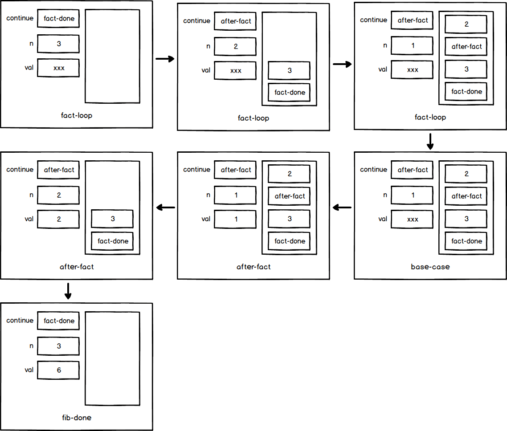
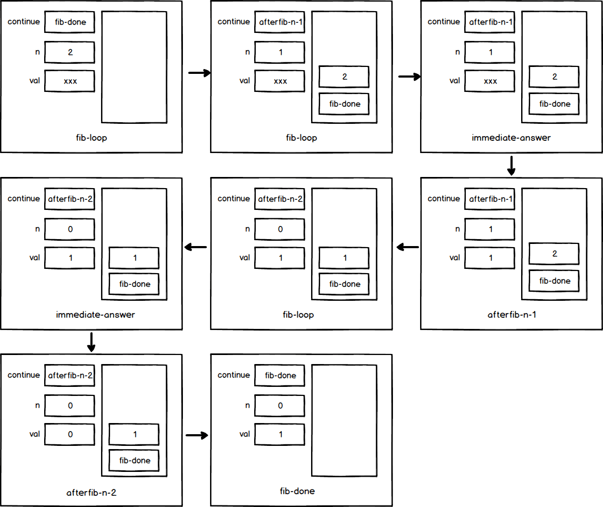

## P358 - [练习 5.5]

### a)

阶乘的计算过程，取 n = 3, 在 fact-loop、after-fact、base-case、fact-done 处，各寄存器和堆栈的值如下图:

其中 val = xxx, 表示 val 还没有初始化。

### b)

斐波那契的计算过程，取 n = 2, 在 fib-loop、 afterfib-n-1、afterfib-n-2、immediate-answer、fib-done 处，各寄存器和堆栈的值如下图:

